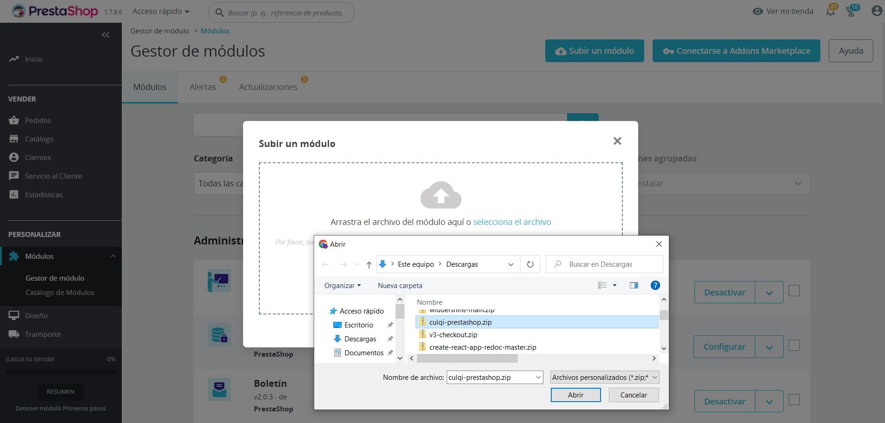
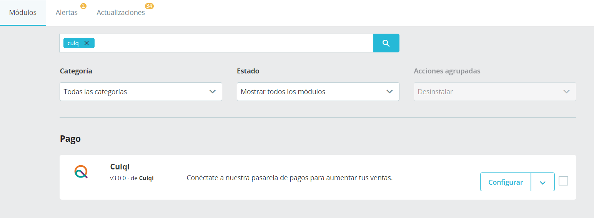
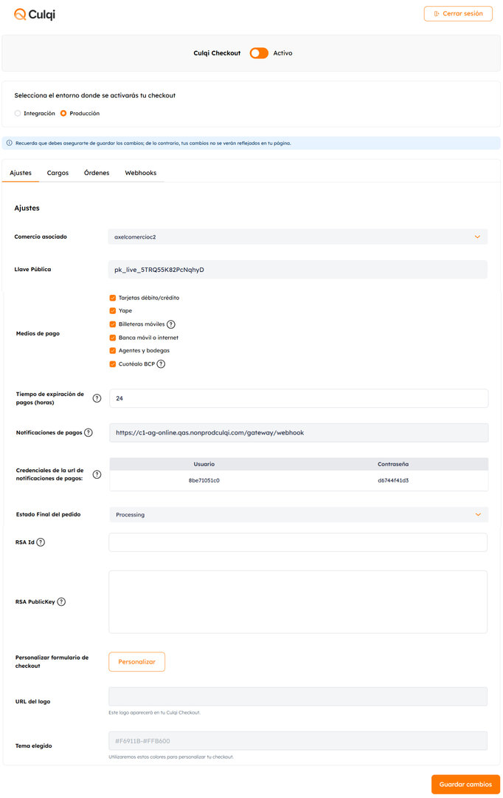
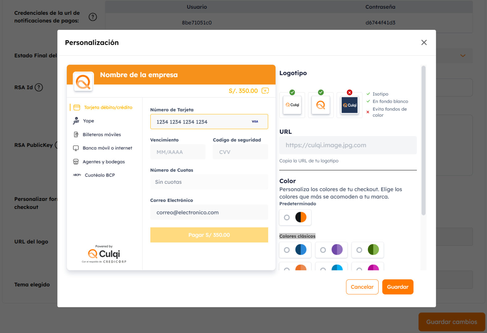

# Plugin - Prestashop 1.7

Nuestro plugin integra por tí nuestro Checkout v4 y nuestra librería JS 3DS, con los cuales tendrás la posibilidad de realizar cobros con tarjetas de débito y crédito, Yape, PagoEfectivo, billeteras móviles y Cuotéalo con solo unos simples pasos de configuración.

> Recuerda que para usar cualquier plugins necesitas tener tu llave pública y llave privada (test o live), los cuales los puedes generar a través de tu Culqipanel.

## Requisitos ##

- PHP 7.0+
- Prestashop 1.7.0+
- [Credenciales de Culqi](https://www.culqi.com)


## Instalación y activación

### Opción 1: Instalación manual con archivo ZIP

Descargar el zip (.zip) de nuestro plugin desde [aquí](https://github.com/culqi/culqi-prestashop-1.7/releases/download/vCulqi-Prestashop1.7/culqi.zip "download") y subirlo como un módulo.



Luego busca el plugin instalado con el nombre de **Culqi** y procedes a activarlo.



### Opción 2: Instalación desde código fuente

Si prefieres usar el código fuente en lugar de descargar un ZIP pre-compilado, puedes construir el plugin manualmente.

**Requisitos:**

- [Composer](https://getcomposer.org/) instalado en tu computadora
- PHP 7.4 o superior

**Pasos:**

1. Descarga o clona el código fuente del plugin desde este repositorio
2. Abre una terminal en la carpeta raíz del proyecto
3. Ejecuta el comando:

    ```bash
    composer run build
    ```

4. Se generará un archivo `dist/culqi-X.X.X.zip` (por ejemplo, `dist/culqi-4.0.0.zip`)
5. Sigue los mismos pasos de la **Opción 1** para subir el ZIP a Prestashop

> **Nota:** Si ya tienes una versión anterior del plugin instalada, te recomendamos desactivarla y eliminarla antes de instalar la nueva versión.

## Configuración

A continuación se presenta una imagen de la pantalla de configuración:



Ingresa en la sección "Settings" para configurar el plugin.
Independiente del mecanismo de instalación, los pasos para configurar el plugin son los mismos.

1. Activa tu Culqi checkout: Siempre debes mantenerlo activo para que tu checkout se muestre en tu tienda virtual.

2. Selecciona el ambiente (integración o producción): Este paso es esencial para que determines cuándo realizar pruebas y cuándo activar tu tienda en producción. Sirve también para indicar en que ambiente de CulqiPanel vas iniciar sesión.

3. Iniciar sesión: Con este boton podrás iniciar sesión en tu CulqiPanel y podrás obtener las llaves de tu comercio automáticamente.

> Recuerda que las credenciales son enviadas al correo que registraste en el proceso de afiliación.

4. Ingresa las llaves pública y privada (test o live): Lo puedes hacer de manera manual o automática. Para el segundo, haz click en "Iniciar Sesión" para entrar al CulqiPanel, luego selecciona tu comercio e inserta automáticamente tus llaves.

> Recuerda que las llaves de integración se identifican como "test" y las de producción como "live".

5. Selecciona los métodos de pago: Por defecto nuestro plugin habilita los pagos con tarjeta. Sin embargo, si deseas habilitar otros medios de pago (Banca móvil e internet, Agentes y bodegas, Billeteras móviles, Cuotéalo BCP) solo debes activar los "checks".

6. Define el tiempo de expiración de pago: Debes definirlo si habilitarás pagos con PagoEfectivo, billeteras móviles o Cuotéalo.

> Recuerda que si no configuras el tiempo de expiración, este tomará el tiempo por defecto: 24 horas.

7. Registra notificaciones de pago (Webhook): Valida en tu CulqiPanel que la URL de notificaciones de pago sea correcta.


> Recuerda que si no iniciaste sesión en el Culqipanel desde el plugin, debes configurar manualmente la URL de Webhook con el <b>evento (order.status.changed)</b>. Sigue los pasos [aquí](https://docs.culqi.com/es/documentacion/pagos-online/webhooks/).

8. Personaliza tu checkout: Con esta opción puedes cambiar los colores preestablecidos por los colores de tu marca, así como el logo.




9. Finalmente guarda tu configuración: ¡Listo!, Tus clientes ya pueden realizar pagos a través de tu tienda virtual.


## Pruebas

Antes de activar tu tienda en producción, te recomendamos realizar pruebas de integración. Así garantizarás un correcto despliegue.

Si vas a empezar a vender desde tu tienda virtual, deberás seleccionar el ambiente de producción e ingresar tus llaves.

> Recuerda que si quieres probar tu integración, puedes utilizar nuestras [tarjetas de prueba.](https://docs.culqi.com/es/documentacion/pagos-online/tarjetas-de-prueba/)

## Versiones disponibles

Contamos con las siguientes versiones:

<table
  class="mx-auto max-w-4xl w-full whitespace-nowrap bg-transparent divide-y divide-culqi-gray-ultra-light dark:divide-culqi-plate-light border-2 border-culqi-gray-ultra-light dark:border-culqi-plate-light">
  <thead>
    <tr class="bg-culqi-gray-light dark:bg-culqi-gray-ultra-light text-culqi-plate-light text-left">
      <th class="px-3 py-[14px] font-semibold text-sm"></th>
      <th class="px-3 py-[14px] font-semibold text-sm">Versión</th>
      <th class="px-3 py-[14px] font-semibold text-sm">Descarga</th>
    </tr>
  </thead>
  <tbody class="bg-transparent divide-y divide-culqi-gray-ultra-light dark:divide-culqi-plate-light">
    <tr class="whitespace-nowrap font-normal font-Archivo  text-culqi-plate-dark dark:text-white-gray">
      <td class = "px-3 py-4 font-bold text-sm">
        </br>
      </td>
      <td class = "px-3 py-4 font-bold text-sm">
        1.7.0+
      </td>
      <td class = "px-3 py-4 text-sm">
        <a href='https://github.com/culqi/culqi-prestashop-1.7/releases/download/vCulqi-Prestashop1.7/culqi.zip'>
          Descargar
        </a>
      </td>
    </tr>
  </tbody>
</table>

## Manual de instalación y configuración

Puedes usar el manual para obtener más detalle:

<table
  class="mx-auto max-w-4xl w-full whitespace-nowrap bg-transparent divide-y divide-culqi-gray-ultra-light dark:divide-culqi-plate-light border-2 border-culqi-gray-ultra-light dark:border-culqi-plate-light">
  <thead>
    <tr class="bg-culqi-gray-light dark:bg-culqi-gray-ultra-light text-culqi-plate-light text-left">
      <th class="px-3 py-[14px] font-semibold text-sm"></th>
      <th class="px-3 py-[14px] font-semibold text-sm">Descarga</th>
    </tr>
  </thead>
  <tbody class="bg-transparent divide-y divide-culqi-gray-ultra-light dark:divide-culqi-plate-light">
    <tr class="whitespace-nowrap font-normal font-Archivo  text-culqi-plate-dark dark:text-white-gray">
      <td class = "px-3 py-4 font-bold text-sm">
        </br>
      </td>
      <td class = "px-3 py-4 text-sm">
        <a href='https://docs.culqi.com/pdf/manual_prestashop.pdf' download>
          Descargar
        </a>
      </td>
    </tr>
  </tbody>
</table>


